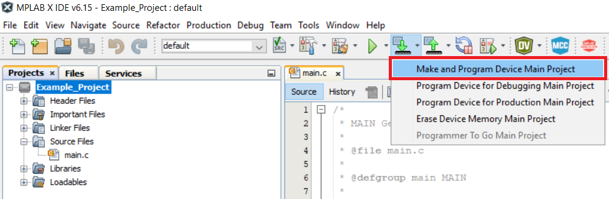

<!-- Please do not change this html logo with link -->

# Bi-Phase Decoder with Configurable Bitrate Based on CLB Using the PIC16F13145 Microcontroller with MCC Melody

The repository contains the Bi-Phase Decoder, an MPLAB® X project, using Core Independent Peripherals (CIPs) by following the interaction between Custom Logic Block (CLB), Serial Peripheral Interface (SPI) and Universal Asynchronous Receiver-Transmitter (UART) peripherals.

The CLB peripheral is a collection of logic elements that can be programmed to perform a wide variety of digital logic functions. The logic function may be completely combinatorial, sequential or a combination of the two, enabling users to incorporate hardware-based custom logic into their applications.

The Bi-Phase Mark Code (BMC) combines both data and clock in a single signal. One clock cycle is a BMC bit period. A transition always occurs at the beginning of each bit period. A logic `1` is represented by a transition (rising or falling edge) in the middle of the bit period and a logic `0` is represented by no transition in the middle of the period. A BMC encoder accepts a data signal and clock signal as inputs and produces a single BMC-encoded output. A BMC decoder accepts a BMC-encoded signal as the input and produces two outputs: data and clock. BMC is used in standards such as the USB 3.1 Power Delivery Specification CC signaling, AES3 digital audio or S/PDIF audio. The figure below presents an example:

 

## Related Documentation

More details and code examples on the PIC16F13145 can be found at the following links:

- [PIC16F13145 Product Page](https://www.microchip.com/en-us/product/PIC16F13145?utm_source=GitHub&utm_medium=TextLink&utm_campaign=MCU8_MMTCha_PIC16F13145&utm_content=pic16f13145-biphase-decoder-mplab-mcc&utm_bu=MCU08)
- [PIC16F13145 Code Examples on Discover](https://mplab-discover.microchip.com/v2?dsl=PIC16F13145)
- [PIC16F13145 Code Examples on GitHub](https://github.com/microchip-pic-avr-examples/?q=PIC16F13145)
- [Bi-Phase Encoder with Configurable Bitrate Based on CLB Using the PIC16F13145 Microcontroller with MCC Melody](https://github.com/microchip-pic-avr-examples/pic16f13145-biphase-encoder-mplab-mcc)
- [Bi-Phase Encoder and Decoder - Use Cases for CIPs Using the AVR128DA48 Microcontroller with MCC Melody](https://github.com/microchip-pic-avr-examples/avr128da48-cnano-biphase-mplab-mcc)

## Software Used

- [MPLAB X IDE v6.20 or newer](https://www.microchip.com/en-us/tools-resources/develop/mplab-x-ide?utm_source=GitHub&utm_medium=TextLink&utm_campaign=MCU8_MMTCha_PIC16F13145&utm_content=pic16f13145-biphase-decoder-mplab-mcc&utm_bu=MCU08)
- [MPLAB® XC8 v2.46 or newer](https://www.microchip.com/en-us/tools-resources/develop/mplab-xc-compilers?utm_source=GitHub&utm_medium=TextLink&utm_campaign=MCU8_MMTCha_PIC16F13145&utm_content=pic16f13145-biphase-decoder-mplab-mcc&utm_bu=MCU08)
- [PIC16F1xxxx_DFP v1.25.389 or newer](https://packs.download.microchip.com/)

## Hardware Used

- The [PIC16F13145 Curiosity Nano Development board](https://www.microchip.com/en-us/development-tool/EV06M52A?utm_source=GitHub&utm_medium=TextLink&utm_campaign=MCU8_MMTCha_PIC16F13145&utm_content=pic16f13145-biphase-decoder-mplab-mcc&utm_bu=MCU08) is used as a test platform:
   

## Operation

To program the Curiosity Nano board with this MPLAB X project, follow the steps provided in the [How to Program the Curiosity Nano Board](#how-to-program-the-curiosity-nano-board) chapter.  

## Concept

The encoded data is received through a single data wire. The Non-Return-to-Zero (NRZ) signal and clock signal are recovered using the circuit composed of the logic elements contained within the CLB peripheral described in the figure below. The resulting signals are routed to the SPI peripheral which reads and stores the data into the internal buffer called `FrameBuffer`, then the decoded data is transmitted further via the UART serial communication, when the encoded message is fully received.

 

The Bi-Phase encoded signal is received through a single wire, while the decoding circuit is implemented using the CLB peripheral. The decoding circuit outputs the recovered NRZ data and a synchronized clock signal that are routed to the SPI peripheral configured in Client mode. The application software reads the decoded byte and stores it into an internal buffer. When the entire frame is received, the received data is transmitted via serial communication, UART.

The data can be decoded by comparing two consecutive bits of the BMC stream at 0.75 bit period away from the bit boundary. The current implementation of the decoder requires that the first edge in the BMC frame is bit boundary (logic `0`). The first edge is used to start the decoder. To create the 0.75 bit period delay from bit boundary, the hardware counter `pic16f131_counter` clocked at 8 x BMC bitrate is used. The counter's `COUNT_IS_5` output is used to enable bit latching for the SDI output signal. To ensure decoder synchronization with the BMC stream, only bit boundaries edges are allowed to restart the hardware counter. This is done by using a validation latch (right side of the picture) and one logic AND gate. The validation latch will be enabled by the `COUNT_IS_5` output. Also, the hardware counter will be stopped by the `COUNT_IS_7` output. The validation latch and stop logic allow a good frequency tolerance between the BMC encoder and decoder. The `COUNT_IS_7` output enables a counter (`StopCounter` logic circuit) used to detect the end of BMC stream. If no edges are received for seven periods, the SPI Client Select (SS) line is switched to logic `1` to signalize the end of the BMC stream.

## Setup

The following peripheral and clock configurations are set up using the MPLAB Code Configurator (MCC) Melody for the PIC16F13145:

1. Configuration Bits:

   - CONFIG1:
     - External Oscillator mode selection bits: Oscillator not enabled
     - Power-up default value for COSC bits: HFINTOSC (1MHz)
   - CONFIG2:
     - Brown-out reset enable bits: Brown-out reset disabled
   - CONFIG3:
     - WDT operating mode: WDT Disabled, SEN is ignored
        

2. Clock Control:

   - Clock Source: HFINTOSC
   - HF Internal Clock: 32_MHz
   - Clock Divider: 1
      

3. MSSP and SPI:

   - Serial Protocol: SPI
     - Mode: Client
     - SPI Mode: SPI Mode 3
     - Config Name: CLIENT_CONFIG
     - Interrupt Driven: Disabled
        

4. CLB:

   - Enable CLB: Enabled
   - Clock Selection: TMR2_PostScaler
   - Clock Divider: Divide clock source by 1
      

5. CRC:

   - Auto-configured by CLB

6. NVM:

   - Auto-configured by CLB

7. UART1:

   - Requested Baudrate: 57600
   - Data Size: 8
   - Receive Enable: Enabled
   - Serial Port Enable: Enabled
       

8. TMR2:

   - Enable Timer: Enabled
   - Control Mode: Roll over pulse
   - Start/Reset Option: Software control
   - Clock Source: HFINTOSC
   - Time Period (s): 0.000002 (2 μs)
      

9. Pin Grid View:
   - EUSART1 TX1: RC4
   - CLBPPSOUT0: RC3 (Data for SPI)
   - CLBPPSOUT1: RB4 (Clock for SPI)
   - CLBPPSOUT2: RB5 (Client Select for SPI)
   - CLBIN0PPS: RA2 (Encoded data from the encoder)
   - MSSP1 SCK: RB4
   - MSSP1 SDI: RC3
   - MSSP1 SS: RB5 (SS_SSP1 pin)
      

## Demo

In the demo, the `Microchip!` message was inserted by the user in the terminal and encoded on source. The signal received on the RA2 pin, Bi-Phase encoded signal, and the three outputs of the CLB are visualized using a logic analyzer.

 

To use the embedded decoder from the Logic software, the next analyzers settings must be set:

1. BMC settings:
    
2. SPI settings:
    

Also, the `Microchip!` message was inserted by the user in the terminal. The output pin of the encoder platform (left side), BMC out (the output pin for the Bi-Phase encoded signal), is connected to the input pin of the decoder board and it is visualized using MPLAB Data Visualizer plug-in.

 

## Summary

This example demonstrates the capabilities of the CLB, a CIP, that can encode a message from the SPI and UART modules.

## How to Program the Curiosity Nano Board

This chapter demonstrates how to use the MPLAB X IDE to program a PIC® device with an `Example_Project.X`. This is applicable to other projects.

1.  Connect the board to the PC.

2.  Open the `Example_Project.X` project in MPLAB X IDE.

3.  Set the `Example_Project.X` project as main project.
     Right click the project in the **Projects** tab and click **Set as Main Project**.
     

4.  Clean and build the `Example_Project.X` project.
     Right click the `Example_Project.X` project and select **Clean and Build**.
     

5.  Select **PICxxxxx Curiosity Nano** in the Connected Hardware Tool section of the project settings:
     Right click the project and click **Properties**.
     Click the arrow under the Connected Hardware Tool.
     Select **PICxxxxx Curiosity Nano** (click the **SN**), click **Apply** and then click **OK**:
     

6.  Program the project to the board.
     Right click the project and click **Make and Program Device**.
     

 

---

## Menu

- [Back to Top](#bi-phase-decoder-with-configurable-bitrate-based-on-clb-using-the-pic16f13145-microcontroller-with-mcc-melody)
- [Back to Related Documentation](#related-documentation)
- [Back to Software Used](#software-used)
- [Back to Hardware Used](#hardware-used)
- [Back to Operation](#operation)
- [Back to Concept](#concept)
- [Back to Setup](#setup)
- [Back to Demo](#demo)
- [Back to Summary](#summary)
- [Back to How to Program the Curiosity Nano Board](#how-to-program-the-curiosity-nano-board)
